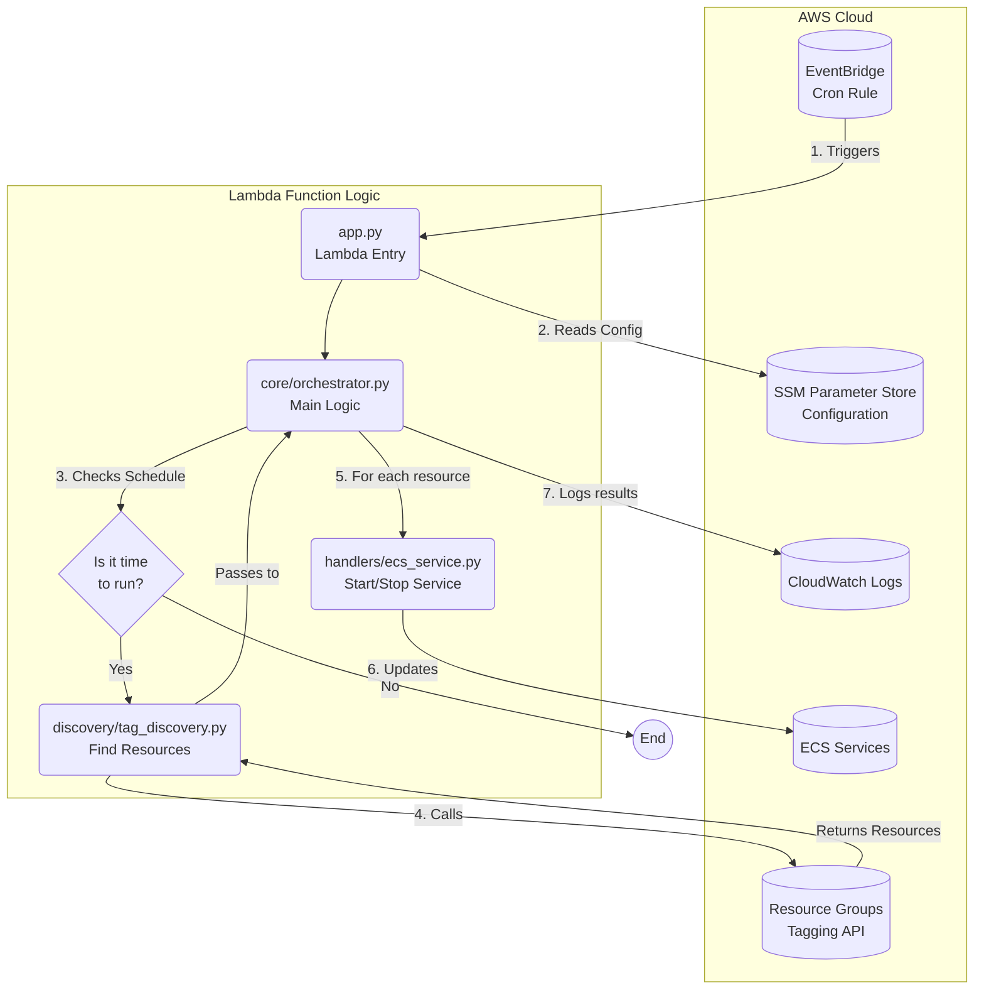

# Architecture Diagram

```mermaid
graph TD
    subgraph "AWS Cloud"
        direction LR
        EventBridge[("EventBridge<br>Cron Rule")]
        SSM[("SSM Parameter Store<br>Configuration")]
        TaggingAPI[("Resource Groups<br>Tagging API")]
        ECS[("ECS Services")]
        CloudWatch[("CloudWatch Logs")]
    end

    subgraph "Lambda Function Logic"
        direction TB
        Handler("app.py<br>Lambda Entry")
        Orchestrator("core/orchestrator.py<br>Main Logic")
        TimeCheck{"Is it time<br>to run?"}
        Discover("discovery/tag_discovery.py<br>Find Resources")
        Action("handlers/ecs_service.py<br>Start/Stop Service")
    end

    %% Connections
    EventBridge -- "1. Triggers" --> Handler
    Handler -- "2. Reads Config" --> SSM
    Handler --> Orchestrator

    Orchestrator -- "3. Checks Schedule" --> TimeCheck
    TimeCheck -- "No" --> Stop((End))
    TimeCheck -- "Yes" --> Discover

    Discover -- "4. Calls" --> TaggingAPI
    TaggingAPI -- "Returns Resources" --> Discover
    Discover -- "Passes to" --> Orchestrator

    Orchestrator -- "5. For each resource" --> Action
    Action -- "6. Updates" --> ECS

    Orchestrator -- "7. Logs results" --> CloudWatch
```
