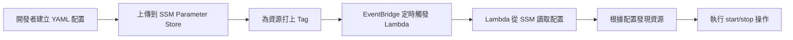

# SSM Parameter Store 操作指南

本指南說明如何透過 SSM Parameter Store 管理 Lights-Out Lambda 配置。基於 sss-lab 環境的實際部署經驗整理。

## 目錄
1. [工作流程總覽](#工作流程總覽)
2. [初始設定](#初始設定)
3. [日常操作](#日常操作)
4. [故障排除](#故障排除)

---

## 工作流程總覽



**關鍵點：**
- 配置改變無需重新部署 Lambda（熱更新）
- Lambda 啟動時才讀取 SSM，5 分鐘內用 cache
- 多環境共用同一個 Lambda，靠 SSM 參數區分

---

## 初始設定

### Step 1: 建立 SSM 參數

#### 方法 A：使用 pnpm script（推薦）

```bash
# 自動從 config/sss-lab.yml 轉換並上傳至 SSM
pnpm run config:update

# 預期輸出：
# ✅ SSM Parameter updated successfully
# Version: 1
```

#### 方法 B：使用 AWS CLI（手動）

```bash
# 建立/更新 SSM Parameter
aws ssm put-parameter \
  --name "/lights-out/config" \
  --type "String" \
  --value "$(node -e "const yaml = require('js-yaml'); const fs = require('fs'); console.log(JSON.stringify(yaml.load(fs.readFileSync('config/sss-lab.yml', 'utf8'))));")" \
  --description "Lights Out configuration for sss-lab" \
  --region ap-southeast-1 \
  --overwrite
```

**說明：**
- ✅ Parameter 名稱統一為 `/lights-out/config`
- ✅ 使用 `--overwrite` 可更新現有配置
- ✅ 配置內容從 `config/sss-lab.yml` 自動轉換為 JSON
- ⚠️ 不能同時使用 `--tags` 和 `--overwrite`

**成本：** 標準參數（<4KB）免費

#### 方法 C：使用 AWS Console

1. 前往 **Systems Manager > Parameter Store**
2. 點擊 **Create parameter**
3. 填入：
   - Name: `/lights-out/config`
   - Type: `String`
   - Value: 貼上 JSON 格式配置（從 YAML 轉換）
4. 點擊 **Create parameter**

**注意：** Console 方式需手動將 YAML 轉換為 JSON，建議使用 pnpm script 或 CLI。

---

### Step 2: 為 AWS 資源打標籤

**必要標籤：**
```
lights-out:managed  = true      # 必須，標記此資源受 lights-out 管理
lights-out:env      = sss-lab   # 必須，對應 SSM 配置中的 environment
lights-out:priority = 100       # 選填，啟動順序（數字小 = 先啟動/後關閉）
```

#### 範例：標記 ECS Service

```bash
# 取得 ECS Service ARN
aws ecs list-services --cluster YOUR_CLUSTER_NAME

# 打標籤
aws ecs tag-resource \
  --resource-arn arn:aws:ecs:ap-southeast-1:ACCOUNT_ID:service/CLUSTER/SERVICE \
  --tags \
    key=lights-out:managed,value=true \
    key=lights-out:env,value=sss-lab \
    key=lights-out:priority,value=50 \
  --region ap-southeast-1
```

#### 範例：標記 RDS Instance

```bash
# 打標籤
aws rds add-tags-to-resource \
  --resource-name arn:aws:rds:ap-southeast-1:ACCOUNT_ID:db:INSTANCE_NAME \
  --tags \
    Key=lights-out:managed,Value=true \
    Key=lights-out:env,Value=sss-lab \
    Key=lights-out:priority,Value=100 \
  --region ap-southeast-1
```

**Priority 設計原則：**
- **數字越小 = 越早啟動 / 越晚關閉**
- **ECS Service (priority=50)** → 先啟動，先關閉
- **RDS Database (priority=100)** → 後啟動，後關閉
- 確保應用層先啟動再連資料庫，關閉時先斷連再關 DB

詳見 [tagging-guide.md](./tagging-guide.md)

---

### Step 3: 驗證部署

EventBridge 排程規則已由 Serverless Framework 自動建立（定義於 `serverless.yml`）。

```bash
# 檢查 EventBridge Rules
aws events list-rules \
  --name-prefix lights-out-sss-lab \
  --region ap-southeast-1 \
  --query 'Rules[].{Name:Name,State:State,Schedule:ScheduleExpression}' \
  --output table

# 預期輸出：
# +---------------------------------+----------+---------------------------+
# |          Name                   |  State   |  Schedule                 |
# +---------------------------------+----------+---------------------------+
# |  lights-out-sss-lab-start      | ENABLED  | cron(0 1 ? * MON-FRI *)   |
# |  lights-out-sss-lab-stop       | ENABLED  | cron(0 11 ? * MON-FRI *)  |
# +---------------------------------+----------+---------------------------+
```

**說明：**
- `cron(0 1 ? * MON-FRI *)` = 每週一至五 09:00 TPE（01:00 UTC）啟動資源
- `cron(0 11 ? * MON-FRI *)` = 每週一至五 19:00 TPE（11:00 UTC）停止資源
- EventBridge cron 使用 **UTC 時區**，台北時間 (UTC+8) 需減 8 小時

---

## 日常操作

### 修改配置

**場景：** 需要調整資源管理配置（如新增 region、修改標籤過濾條件等）

```bash
# 1. 編輯本地配置檔案
vim config/sss-lab.yml

# 2. 更新 SSM Parameter
pnpm run config:update

# 3. 驗證更新
aws ssm get-parameter \
  --name "/lights-out/config" \
  --region ap-southeast-1 \
  --query 'Parameter.{Version:Version,LastModified:LastModifiedDate}'

# 4. 測試配置（會立即讀取新配置）
aws lambda invoke \
  --function-name lights-out-sss-lab-handler \
  --payload '{"action":"discover"}' \
  --region ap-southeast-1 \
  out.json && cat out.json | jq .
```

**注意：**
- Lambda 每次執行會從 SSM 讀取最新配置
- 配置變更無需重新部署 Lambda
- 建議在 Git 中管理配置檔案，保留變更歷史

---

### 查看配置歷史

SSM Parameter Store 自動保留參數的歷史版本：

```bash
# 查看參數歷史版本
aws ssm get-parameter-history \
  --name "/lights-out/config" \
  --region ap-southeast-1 \
  --query 'Parameters[-5:].[Version,LastModifiedDate,LastModifiedUser]' \
  --output table

# 回滾到特定版本
aws ssm get-parameter \
  --name "/lights-out/config:2" \
  --region ap-southeast-1 \
  --query 'Parameter.Value' \
  --output text > rollback-config.json

# 將回滾的配置重新套用
aws ssm put-parameter \
  --name "/lights-out/config" \
  --value file://rollback-config.json \
  --type String \
  --overwrite \
  --region ap-southeast-1
```

---

### 暫時停用排程

**場景：** 需要進行長時間測試，暫時不要自動關閉資源

```bash
# 方式 1：停用 EventBridge 規則（推薦）
aws events disable-rule --name "lights-out-sss-lab-stop" --region ap-southeast-1

# 驗證狀態
aws events list-rules \
  --name-prefix lights-out-sss-lab \
  --region ap-southeast-1 \
  --query 'Rules[].{Name:Name,State:State}'

# 測試完成後恢復
aws events enable-rule --name "lights-out-sss-lab-stop" --region ap-southeast-1
```

```bash
# 方式 2：移除資源標籤（影響範圍更大，不推薦）
# 移除特定資源的 lights-out:managed 標籤
aws ecs tag-resource \
  --resource-arn SERVICE_ARN \
  --tags key=lights-out:managed,value=false \
  --region ap-southeast-1
```

---

### 新增假日排除規則

```bash
# 1. 編輯配置檔案
vim config/sss-lab.yml

# 2. 在 schedules.default 中新增假日清單
#   schedules:
#     default:
#       holidays:
#         - "2026-01-01"  # 元旦
#         - "2026-02-10"  # 春節
#         - "2026-12-25"  # 聖誕節

# 3. 更新 SSM Parameter
pnpm run config:update

# 4. 驗證
aws lambda invoke \
  --function-name lights-out-sss-lab-handler \
  --payload '{"action":"status"}' \
  --region ap-southeast-1 \
  out.json
```

**注意：** 假日當天排程規則仍會觸發 Lambda，但 Lambda 會根據 holidays 清單跳過操作。

---

## 故障排除

### 問題：Lambda 無法讀取 SSM 參數

**錯誤訊息：** `ParameterNotFoundError: Could not find SSM parameter`

**檢查步驟：**

```bash
# 1. 確認參數存在
aws ssm get-parameter --name "/lights-out/dev/airsync"

# 2. 檢查 Lambda IAM Role 權限
aws iam get-role-policy \
  --role-name lights-out-lambda-role \
  --policy-name SSMReadPolicy

# 應包含：
# {
#   "Effect": "Allow",
#   "Action": ["ssm:GetParameter"],
#   "Resource": "arn:aws:ssm:*:*:parameter/lights-out/*"
# }
```

---

### 問題：配置更新後 Lambda 仍使用舊配置

**原因：** LRU Cache 未過期（5 分鐘 TTL）

**解決方案：**

```bash
# 方式 1：等待 5 分鐘讓 cache 自然過期

# 方式 2：手動觸發 Lambda 清除 cache
# (需在 Lambda 中實作 "clear-cache" action)
aws lambda invoke \
  --function-name lights-out \
  --payload '{"action":"clear-cache"}' \
  /tmp/out.json
```

---

### 問題：資源沒有被發現

**檢查步驟：**

```bash
# 1. 確認資源標籤正確
aws resourcegroupstaggingapi get-resources \
  --tag-filters "Key=lights-out:managed,Values=true" \
  --resource-type-filters "ecs:service" \
  --query 'ResourceTagMappingList[*].[ResourceARN,Tags]'

# 2. 手動觸發 discover action
aws lambda invoke \
  --function-name lights-out \
  --payload '{"action":"discover","parameter_name":"/lights-out/dev/airsync"}' \
  /tmp/discover-result.json

# 3. 查看發現的資源
cat /tmp/discover-result.json | jq '.discovered_resources'
```

---

## 安全性最佳實踐

### 1. 使用 IAM 限制誰能修改配置

```json
{
  "Version": "2012-10-17",
  "Statement": [
    {
      "Effect": "Allow",
      "Action": ["ssm:PutParameter", "ssm:GetParameter"],
      "Resource": "arn:aws:ssm:ap-northeast-1:123456789012:parameter/lights-out/dev/*",
      "Condition": {
        "StringEquals": {
          "aws:PrincipalTag/Team": "AirSync-DevOps"
        }
      }
    }
  ]
}
```

**Why：** 確保只有 AirSync DevOps 團隊能修改 dev 環境配置

---

### 2. 啟用 CloudTrail 審計

```bash
# 查詢誰修改了 SSM 參數
aws cloudtrail lookup-events \
  --lookup-attributes AttributeKey=ResourceName,AttributeValue=/lights-out/dev/airsync \
  --query 'Events[*].[EventTime,Username,EventName]' \
  --output table
```

---

### 3. 使用 Parameter Store Versioning

```bash
# SSM 自動保留歷史版本，可隨時回滾
aws ssm get-parameter-history \
  --name "/lights-out/dev/airsync" \
  --query 'Parameters[-3:].[Version,LastModifiedDate]'  # 查看最近 3 次修改

# 回滾到特定版本
aws ssm get-parameter \
  --name "/lights-out/dev/airsync:2" \
  --query 'Parameter.Value' \
  --output text > rollback-config.yaml

aws ssm put-parameter \
  --name "/lights-out/dev/airsync" \
  --value file://rollback-config.yaml \
  --overwrite
```

---

## 成本估算

**假設：** 4 個環境 (AirSync dev/stage, VS Account dev/stage)

| 項目 | 用量 | 成本/月 |
|------|------|---------|
| SSM 標準參數 | 4 個 (<4KB) | **$0** (免費) |
| EventBridge 規則 | 8 個 (每環境 2 個) | **$0** (免費配額內) |
| Lambda 執行 | 60 次/月 (每天 2 次 × 30 天) | **$0** (免費配額內) |
| **總計** | - | **$0/月** |

**Why SSM vs S3：**
- S3 儲存 $0.023/GB + GET 請求費用
- SSM 標準參數完全免費

---

## 相關文件

- [deployment-guide.md](./deployment-guide.md) - 完整部署指南
- [tagging-guide.md](./tagging-guide.md) - 資源標籤操作指南
- [config/README.md](../config/README.md) - 配置檔案說明
- [CLAUDE.md](../CLAUDE.md) - 專案架構與規範
